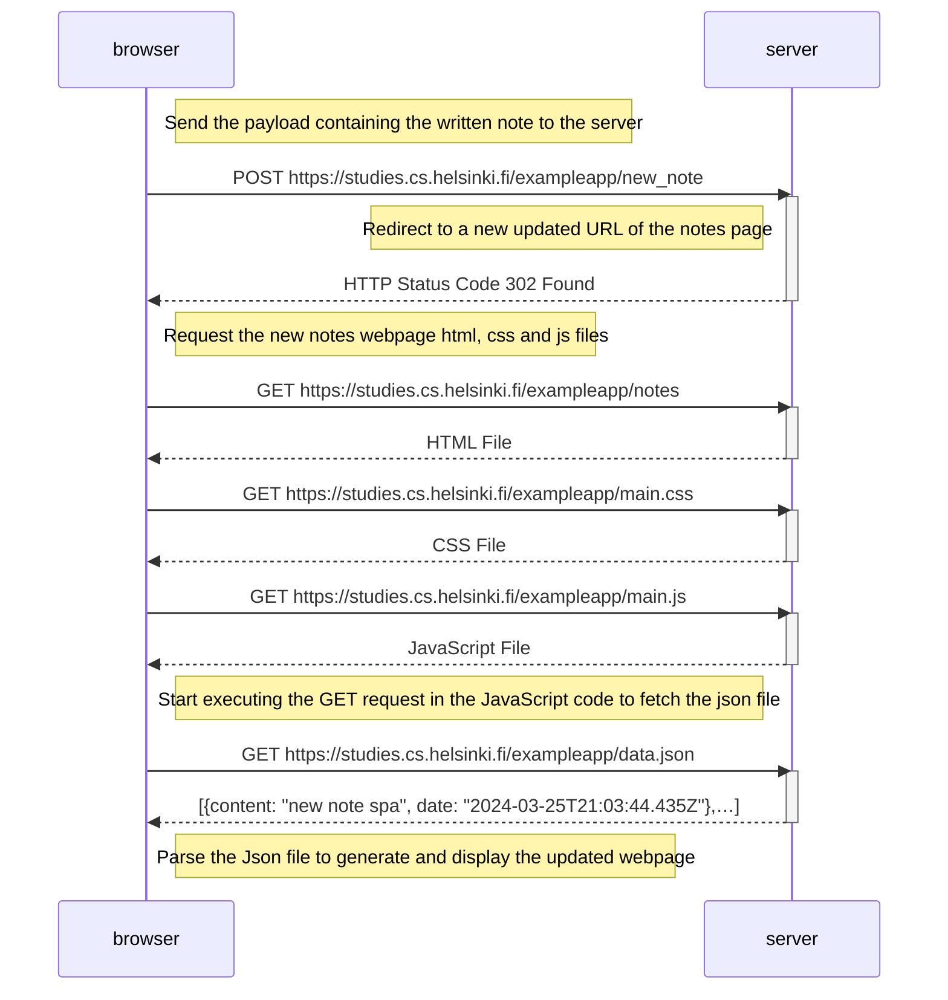

```mermaid

sequenceDiagram
    participant browser
    participant server

    Note right of browser: Send the payload containing the written note to the server
    browser->>server: POST https://studies.cs.helsinki.fi/exampleapp/new_note
    activate server
    Note left of server: Redirect to a new updated URL of the notes page
    server-->>browser: HTTP Status Code 302 Found
    deactivate server

    Note right of browser: Request the new notes webpage html, css and js files
    browser->>server: GET https://studies.cs.helsinki.fi/exampleapp/notes
    activate server
    server-->>browser: HTML File
    deactivate server

    browser->>server: GET https://studies.cs.helsinki.fi/exampleapp/main.css
    activate server
    server-->>browser: CSS File
    deactivate server

    browser->>server: GET https://studies.cs.helsinki.fi/exampleapp/main.js
    activate server
    server-->>browser: JavaScript File
    deactivate server
    Note right of browser: Start executing the GET request in the JavaScript code to fetch the json file

    browser->>server: GET https://studies.cs.helsinki.fi/exampleapp/data.json
    activate server
    server-->>browser: [{content: "new note spa", date: "2024-03-25T21:03:44.435Z"},…]
    deactivate server
    Note right of browser: Parse the Json file to generate and display the updated webpage

```