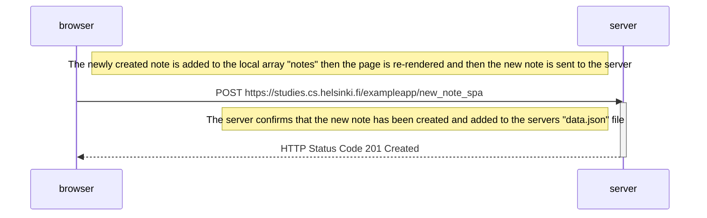

```mermaid
    sequenceDiagram
    participant browser
    participant server

    Note right of browser: The newly created note is added to the local array "notes" then the page is re-rendered and then the new note is sent to the server
    browser->>server: POST https://studies.cs.helsinki.fi/exampleapp/new_note_spa
    activate server
    Note left of server: The server confirms that the new note has been created and added to the servers "data.json" file
    server-->>browser: HTTP Status Code 201 Created
    deactivate server
```
